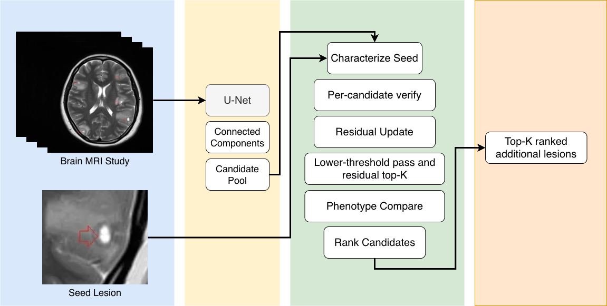

# SecondLook-MRI

> A calibrated vision–language agent for auditable discovery of *additional* brain metastases on multimodal MRI.

SecondLook-MRI is a second-pass agent that pairs a published 4-channel nnU-Net detector with a 7B vision–language verifier (Qwen2.5-VL-7B) fine-tuned via LoRA SFT and calibrated via LoRA DPO. Given a multimodal brain MRI study and one *seed* lesion (the radiologist's first finding), the agent runs a deterministic seven-step radiology-search protocol and returns a ranked list of additional candidate metastases, each accompanied by a structured per-candidate evidence card (supporting features, contradicting features, mimic risk, written rationale).



This repository contains the code, configs, and reproduction scripts for the project.

## Headline results

| metric | nnU-Net baseline | + Agent | Δ |
| :-- | --: | --: | --: |
| **UCSF-BMSR test (n=47 multi-lesion)** | | | |
| recall @ FP=1 | 0.361 | **0.478** | +11.7 |
| recall @ FP=2 | 0.459 | **0.529** | +7.0 |
| MRR | 0.469 | **0.556** | +8.7 |
| audit overlap | — | **0.277** | — |
| **Stanford BrainMetShare (n=87, external validation)** | | | |
| recall @ FP=2 | 0.321 | **0.386** | +6.5 |
| recall @ FP=5 | 0.426 | **0.460** | +3.4 |
| MRR | 0.477 | **0.541** | +6.4 |

All inference is local on a single consumer GPU (RTX 5090), at \$0 per study using the rule-based orchestrator (`--agent rule --vlm local-qwen`). Total project spend: ~\$30 (one-time hosted-VLM data labeling for the SFT corpus).

> **Leakage caveat (UCSF only):** the published BMSR nnU-Net was trained on the full 461-study UCSF-BMSR cohort, including this project's held-out 47-study test split. UCSF baseline numbers therefore reflect partial test-set memorization, and the UCSF agent results should be read as *agent over leakage-inflated detector*. Stanford BrainMetShare is the leakage-clean external validation cohort.

> **This is research code from a course project.** Not clinical software, not approved for diagnostic use. The published BMSR nnU-Net was trained on the full UCSF-BMSR dataset including our 47-study test split, so absolute UCSF baselines reflect partial test-set memorization; the leakage-clean Stanford numbers are the load-bearing generalization claim. 
## Project structure

```
brain_mets_agent/         # core Python package
  data/                     loaders, splits, seed selection, phenotype features
  models/                     nnU-Net + AURORA caching adapters, candidate proposal
  orchestrator/             7-step rule-based + LLM-driven agents, evidence cards
    tools/                    propose / verify / residual / ranker / viewer / phenotype
  eval/                     FROC, recall@FP/study, top-k recall, MRR, audit overlap
configs/                  YAML configs (paths + hyperparameters)
scripts/                  runnable training, evaluation, and figure-generation scripts
tests/                    smoke tests (mock backends, no GPU required)
FRAMEWORK.md              architecture deep-dive (training data construction, SFT/DPO recipe, ranker, ablations)
PROGRESS.md               chronological project log of every experiment, including negative results
```

## Installation

```bash
# clone + install in editable mode
git clone https://github.com/philmorefkoung/SecondLook/ secondlook-mri
cd secondlook-mri
pip install -r requirements.txt
pip install -e .

# run the smoke tests (no GPU required)
pytest tests/
```

The verifier and detector backends are heavy and require additional setup:

- **Qwen2.5-VL-7B**: pulled automatically via `transformers` on first use.
- **nnU-Net Task115_Metastases_All**: requires a separate Python 3.10 conda env (`nnunet1`) because the legacy `nnunet` package predates Python 3.13. See `scripts/run_nnunet_inference.py` for the exact patches needed (three unpicklable lambdas in the installed `nnunet` package must be replaced with `nn.Identity()` for Windows `multiprocessing.spawn`).
- **AURORA detector** (used in the ensemble ablation only): `pip install brainles-aurora`.

## Data

The repository contains **no patient data**. Both cohorts are publicly released but require completing data-use agreements:

- **UCSF-BMSR** (Rudie et al., *Radiology: AI* 2024). Apply via the UCSF AIMI portal. We use the released 461-study TRAIN split, partitioned patient-grouped into train / val / test of 334 / 67 / 60 studies.
- **Stanford BrainMetShare** (Grøvik et al. 2020). Public download from the Stanford AIMI portal. We use the 87 multi-lesion subset for external validation.

Once acquired, run `scripts/inventory.py` and `scripts/stage_stanford.py` to normalize the file layout into the loader's expected structure.

## Reproducing the results

The full pipeline is:

```
data → detector inference → SFT corpus → SFT adapter → DPO pairs → DPO adapter
     → cached agent state → ranker sweep → figures
```

End-to-end reproduction takes roughly 8–12 hours on a single RTX 5090 (most of which is the SFT data-collection pass through the training set with the Anthropic Sonnet 4.6 teacher; budget ~\$40 of API spend).

### 1. Detector inference (one-time, ~15 min for 60 UCSF studies)

```bash
python scripts/run_nnunet_inference.py \
    --studies <study-ids> \
    --out runs/nnunet_probmap_ucsf
```

Outputs binary segmentations + cached probmaps the agent reads via `NNUNetProbmapCache`.

### 2. SFT corpus + adapter (~46 min training)

```bash
# Generate evidence-card / verdict pairs across 240 train studies (uses Anthropic Sonnet as teacher)
ANTHROPIC_API_KEY=... \
python scripts/generate_sft_data.py --split train --offset 0 --limit 240

# Run the corrector LLM on disagreement examples
python scripts/finalize_sft_targets.py

# Merge into the v2 corpus (2,901 train / 64 val JSONL files)
python scripts/merge_sft.py --out data/sft_combined_v2

# Train the LoRA SFT adapter (rank 16, alpha 32, 2 epochs)
python scripts/sft_qwen_vl.py \
    --train data/sft_combined_v2/train.jsonl \
    --val   data/sft_combined_v2/val.jsonl \
    --out   ckpts/sft_qwen_vl_v2
```

### 3. DPO pairs + adapter (DPO v4 — the recipe that worked)

```bash
# Mine SFT-v2 mistakes from the train cohort
python scripts/mine_sft_v2_mistakes.py --adapter ckpts/sft_qwen_vl_v2/adapter_final

# Filter for high-quality pairs (confidence >= 0.7, decisive GT, decisive detector)
python scripts/filter_dpo_pairs.py

# Balance to 103 confirm + 103 reject directional pairs (writes train.jsonl + val.jsonl)
python scripts/balance_dpo_pairs.py --out data/dpo_pairs_v4

# Train the LoRA DPO adapter (beta=0.05, 1 epoch)
python scripts/dpo_qwen_vl.py \
    --train         data/dpo_pairs_v4/train.jsonl \
    --val           data/dpo_pairs_v4/val.jsonl \
    --base-adapter  ckpts/sft_qwen_vl_v2/adapter_final \
    --beta 0.05 --epochs 1 \
    --out           ckpts/dpo_qwen_vl_v4
```

### 4. Evaluate the agent

```bash
# UCSF test (n=47 multi-lesion); rule-based orchestrator + local Qwen verifier => fully local, $0 / study
python scripts/evaluate.py \
    --root    <UCSF-BMSR root> \
    --splits  brain_mets_agent/data/splits.csv \
    --split   test \
    --predictor nnunet --nnunet-probmap-dir runs/nnunet_probmap_ucsf \
    --agent rule \
    --vlm local-qwen --vlm-adapter ckpts/dpo_qwen_vl_v4/adapter_final \
    --weights-preset verdict_heavy --prob-source vlm_else_detector \
    --save-state-dir runs/state_test_nnunet_dpo_v4 \
    --out runs/eval_test_nnunet_dpo_v4.json

# Stanford external validation (n=87)
python scripts/evaluate.py \
    --root    <Stanford BrainMetShare root> \
    --splits  brain_mets_agent/data/splits_stanford.csv \
    --split   stanford \
    --predictor nnunet --nnunet-probmap-dir runs/nnunet_probmap_stanford \
    --agent rule \
    --vlm local-qwen --vlm-adapter ckpts/dpo_qwen_vl_v4/adapter_final \
    --weights-preset verdict_heavy --prob-source vlm_else_detector \
    --save-state-dir runs/state_stanford_dpo_v4 \
    --out runs/eval_stanford_dpo_v4.json
```

`--save-state-dir` pickles per-study (candidates, verdicts, evidence cards) so the offline ranker sweep does not need to re-invoke the VLM.

> **Note on `--agent` default.** `evaluate.py` defaults to `--agent llm`, which uses Anthropic Sonnet as a tool-calling planner and incurs API cost. The "fully local / $0 per study" headline numbers in the table above use `--agent rule` explicitly, as shown.

### 5. Sweep the ranker (offline, ~seconds, \$0)

```bash
python scripts/sweep_ranker.py \
    --state-dir runs/state_test_nnunet_dpo_v4 \
    --out runs/sweep_test_nnunet_dpo_v4.json
```

This sweeps ~216 (preset × prob_source × knobs) configurations on the cached state and reports the best by MRR. The `verdict_heavy + vlm_else_detector` winner from this sweep is what the headline-results column reports.

### 6. Generate paper figures

Figures are not committed to the repo (they contain rendered MRI slices and are large). Regenerate them locally into a `figures/` directory before compiling the paper:

```bash
mkdir -p figures
python scripts/make_pipeline_figures.py     # fig_01 … fig_08 (per-stage examples)
python scripts/make_results_figures.py      # fig_R1 … fig_R5 (FROC, per-lesion, etc.)
python scripts/make_experiment_figures.py   # fig_E0 … fig_E2 (audit log, miss diagnostic, negative results)
```

All three scripts read from cached eval JSONs and state pickles in `runs/`; no re-evaluation required. The TikZ source for the architecture flowchart (Figure 1 of the paper) is in this repo; compile it with `pdflatex figures/framework_flowchart.tex` once the directory exists.

## Pre-trained checkpoints

We do not bundle model weights with the repo (size). Adapters and the BMSR nnU-Net checkpoint should be hosted separately:

- **DPO v4 adapter** (~18 MB LoRA on Qwen2.5-VL-7B-Instruct): TODO upload to HuggingFace.
- **SFT v2 adapter** (~18 MB): TODO upload to HuggingFace.
- **BMSR nnU-Net Task115_Metastases_All**: download from the BMSR data release; details in `scripts/run_nnunet_inference.py`.

## Negative results (also in the paper)

We tested two recall-ceiling-lifting mechanisms and both failed informatively. They are reported as clean negative results because they draw a sharp boundary on what kind of intervention can actually move the recall floor:

- **Phenotype-similarity-weighted Step 5** (the *phenotype trap*): regressed Stanford recall@5 by 17.7 pp because vessel and choroid-plexus mimics match the seed's voxel-intensity signature.
- **Detector ensemble with AURORA**: lifted recall@10 by +1–5 pp but regressed MRR by 6–8 pp; the AURORA-only candidates are mostly edema halos whose centroids miss the GT match.

Together these show that small-lesion misses on this task are *detector-agnostic* and structurally upstream of any practical agent-side intervention.

## License

MIT — see `LICENSE`.
